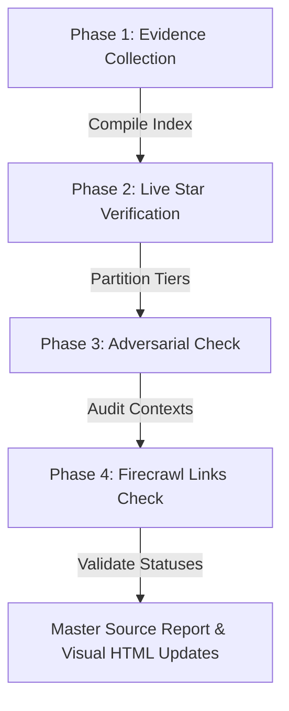

# Evidence Verification Pipeline

This skill orchestrates the four primary verification phases to compile, audit, and validate the Gaia Registry evidence data lake.



---

## The Four Phases

### Phase 1: Evidence Collection (`evidence-collection`)
Aggregates raw evidence from active collectors (`founder/sources/collectors/`) and compiles the master database:
```bash
.venv/bin/python founder/sources/scripts/compile_data_lake.py
```

### Phase 2: Live Star Verification (`live-star-verification`)
Queries the GitHub API for stargazers, validates them against `registry/named/` Markdown files, and generates tiered partitioned raw files under `founder/sources/data_lake/`:
```bash
.venv/bin/python founder/sources/scripts/generate_source_dump.py
```

### Phase 3: Adversarial Check (`adversarial-evidence-audit`)
Deploys parallel adversarial reviewer agents to scan the data lake for evaluative noise, formatting errors (e.g. `tree/` vs `blob/`), and proxy mismatches, appending findings to `founder/sources/source_report_YYYY_MM_DD.md`.

### Phase 4: Firecrawl Links Check (`firecrawl-link-validation`)
Performs an active API link scrape verifying uptime and 200 OK statuses across all unique data lake links:
```bash
.venv/bin/python founder/sources/scripts/validate_sources.py
```

---

## Post-Run Tasks

1. **Verification Records:** Save the validation report inside `founder/sources/collectors/verification/firecrawl_validation_report_YYYY_MM_DD.md`.
2. **Master Source Report:** Document the audit log, star updates, and compiled adversarial details in `founder/sources/source_report_YYYY_MM_DD.md`.
3. **Visual Process Update:** Manually verify and update the statistics and pipeline statuses inside `founder/sources/verification_process.html`.
